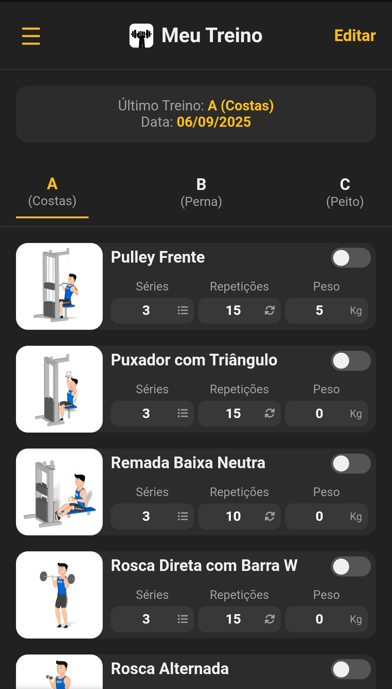
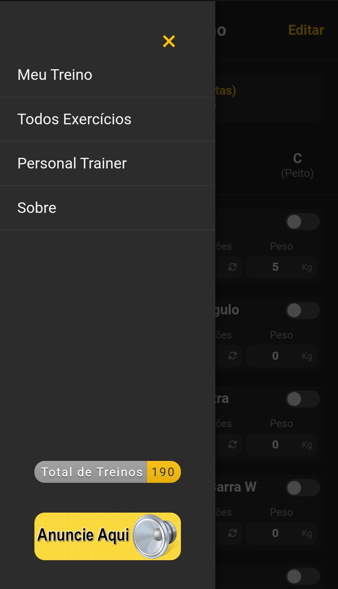

# Meu Treino 💪

  Um aplicativo simples e direto para gerenciar e acompanhar seus treinos de musculação. Desenvolvido para funcionar 100% offline e otimizado para acesso rápido em qualquer dispositivo.

  <strong><a href="https://gymbr.github.io/meutreino/" target="_blank">Acesse a aplicação aqui!</a></strong>

---

## 📸 Pré-visualização

  
  
  

---

## ✨ Funcionalidades Principais

* **📱 Totalmente Offline:** Acesse e edite seus treinos sem precisar de conexão com a internet.
* **✏️ Abas de Treino Editáveis:** Personalize as abas (A, B, C, etc.) com os treinos que preferir.
* **🚀 Otimizado para Mobile:** Interface aprimorada para uma ótima experiência em telas pequenas.
* **⚙️ Configuração Padrão:** Novos usuários já começam com uma estrutura de treino pré-definida para facilitar o primeiro uso.

---

## 📝 Últimas Atualizações

<strong>Clique para ver os detalhes da versão mais recente</strong>

-   **Valores Predefinidos para Novos Usuários:**
    -   Quando um novo dispositivo acessa o site, os exercícios agora são preenchidos automaticamente:
        -   **Treino A (Costas):** Exercício `625`
        -   **Treino B (Perna):** Exercício `276`
        -   **Treino C (Peito):** Exercício `371`
    -   O número padrão de repetições foi alterado de `10` para `12`.

-   **Melhorias Gerais:**
    -   Aprimoramentos na responsividade para telas menores.
    -   Correções de bugs e otimização de performance.

